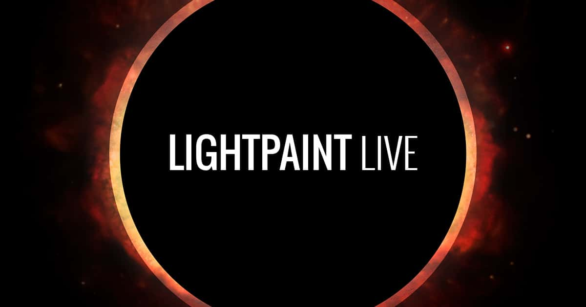
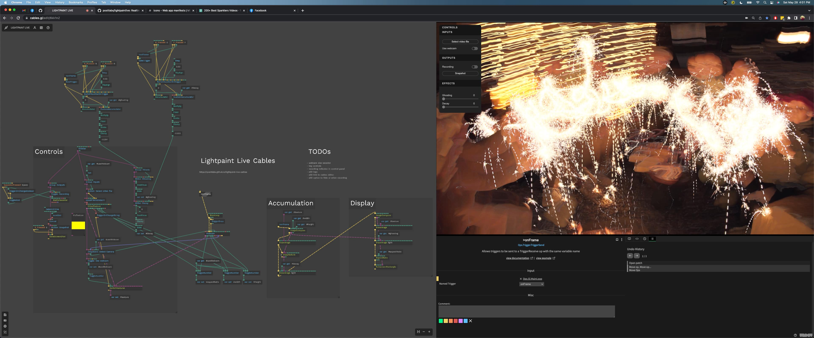
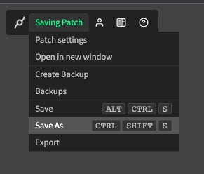

# Lightpaint Live: Cables

[Lightpaint Live](https://lightpaintlive.com/) is a family of apps for realtime light painting. This iteration uses cables.gl and web tech. The idea is to make it easy to use (no app to install), and relatively simple to build on top of, even if you aren't a programmer. 

If you simply want to use the app, visit https://positlabs.github.io/lightpaint-live-cables/

## What Is Cables?

"Cables is an online tool which allows people to create interactive visual web content without having to type a line of code.
It's design and UI make it accessible to all users regardless of experience level.
After 4 years of constant development cables has entered the public beta phase.
Our community grows every single day and we now have over 15,000 registered users creating amazing things.
Cables is free to use and always will be."

[Watch the cables intro video](https://www.youtube.com/watch?v=EPFNHYah9F4&ab_channel=cables_gl)

[More about cables](https://cables.gl/press)

## Customizing LPL

If you are interested in adding your own features (or removing some), or just like to tinker - you can make your own copy of LPL and do what you want with it! 

- Log in to cables.gl
- Visit the project editor: https://cables.gl/edit/6kk1nZ
- Run the "save as" command to create your own copy

## Development

Mostly, this site is just a wrapper around the cables export. It provides a webapp manifest to enable app installation and offline usage. Most of the feature development happens in the cables project. This repository has a few commands, just for pulling updates from cables, and running a local server to test things out before publishing them. 

- `npm run pull`: pulls the latest version from the cables.gl project.
- `npm run serve`: starts a local server.

## Sponsor the project

If you used this in client projects, or simply enjoyed my open-source projects, please consider a donation or sponsorship. One-time donations can be made with PayPal. Subscriptions can be through PayPal or Github Sponsors (click the heart sponsor button at the top of the page).

